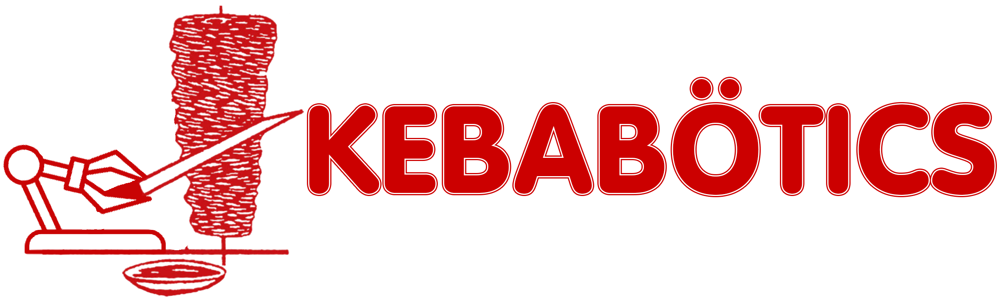

# 

Esta es la aplicación web del proyecto **Kebabötics**, desarrollada en **Laravel**, encargada de gestionar los pedidos, personalización de kebabs, pagos, generación de QR y facturas en PDF, y comunicación con la célula robótica mediante MQTT.

La web forma parte del proyecto completo de automatización de la elaboración de kebabs, donde dos robots colaborativos y uno industrial preparan los pedidos de forma autónoma.

---

## Descripción general del proyecto

Kebabötics busca automatizar por completo el proceso de elaboración de kebabs, mejorando la eficiencia, higiene y calidad del servicio. El sistema está diseñado para:

- Reducir tiempos de espera.  
- Aumentar la higiene del proceso.
- Mejorar las condiciones laborales evitando tareas repetitivas y exposición al calor.
- Garantizar mayor regularidad en los pedidos.
- Hacer el servicio funcional incluso en horarios nocturnos.

La web juega un papel clave como intermediario entre el usuario y la célula robótica, permitiendo realizar y gestionar pedidos, y enviándolos a la línea automatizada mediante MQTT.

---

##  Funcionalidades de la página web

La web incluye:

###  **Sistema de pedidos de kebab**
- Elegir tipo de carne: **pollo**, **ternera** o **mixto**.
- Personalización avanzada de ingredientes (añadir, quitar o modificar).
- Actualización del precio según extras.

###  **Carrito y pago**
- Resumen de pedidos.
- Proceso de pago simulado.
- Confirmación del pedido.

###  **Generación de QR**
- Al completar un pedido, el sistema genera un **QR único** para recogerlo.
- El QR se envía al sistema robótico para saber qué pedido preparar.

###  **Generación de factura en PDF**
- PDF con los datos del pedido.
- El QR también está incluido en la factura.

###  **Sistema de reseñas**
- Tras completar un pedido, el usuario puede dejar una valoración.

###  **Página “Sobre Kebabötics”**
- Descripción del proyecto.
- Equipo de desarrollo.

---

##  Tecnologías utilizadas

- **Laravel**
- **PHP**
- **MySQL**
- **MQTT (Mosquitto + MQTTX)**
- **Composer**
- **RoboDK** (parte del sistema completo)
- **Arduino IDE** (para las placas)
- **XAMPP**
- **Git**

---

##  Instalación (solo parte web)

### 1. Clonar el repositorio

```
git clone https://github.com/alapatacoja/kebabotics_web.git
```

### 2. Instalar dependencias

```
composer install
```

### 3. Crear archivo .env

```
cp .env.example .env
```

Configura en él tu base de datos:

```
DB_DATABASE=nombre
DB_USERNAME=usuario
DB_PASSWORD=contraseña
```

### 4. Generar key y migraciones

```
php artisan key:generate
php artisan migrate
```

### 5. Instalar librerías para QR y facturas

```
composer require simplesoftwareio/simple-qrcode
composer require barryvdh/laravel-dompdf
```

Para evitar errores con imágenes en PDFs, puede requerirse instalar **Imagick**:  
Guía oficial → https://mlocati.github.io/articles/php-windows-imagick.html

### 6. Crear enlace a storage

```
php artisan storage:link
```

### 7. Iniciar servidor local

En XAMPP, inicia **Apache** y **MySQL**, y luego:

```
php artisan serve --host=0.0.0.0 --port=8000
```

---

##  Configuración de MQTT (para comunicación con la célula robótica)

- Encender zona WiFi 2.4GHz en tu dispositivo.
- Obtener tu IP local (ipconfig → IPv4 Wi-Fi).
- Usar esa IP para configurar MQTTX y Mosquitto.
- Crear los topics:

```
kebabotics/pedidos
kebabotics/qr
kebabotics/listos
kebabotics/entregados
kebabotics/emergencia
```

También es necesario modificar la IP en:

- `app/services/MqttService.php`
- `app/console/commands/escucharentregados.php`
- Scripts de RoboDK (`sincronizacion.py`, `MAIN_fase2.py`)
- Código de Arduino para las placas

---

## Puesta en marcha del sistema completo

1. Ejecutar **Mosquitto** y conectar en **MQTTX**.  
2. Subir el código a las placas desde **Arduino IDE**.  
3. Ejecutar la web con `php artisan serve`.  
4. En otra terminal, iniciar el listener MQTT:

```
php artisan mqtt:escucharentregados
```

---
